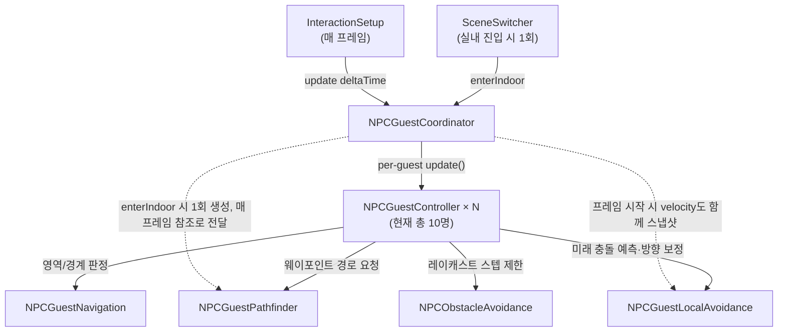
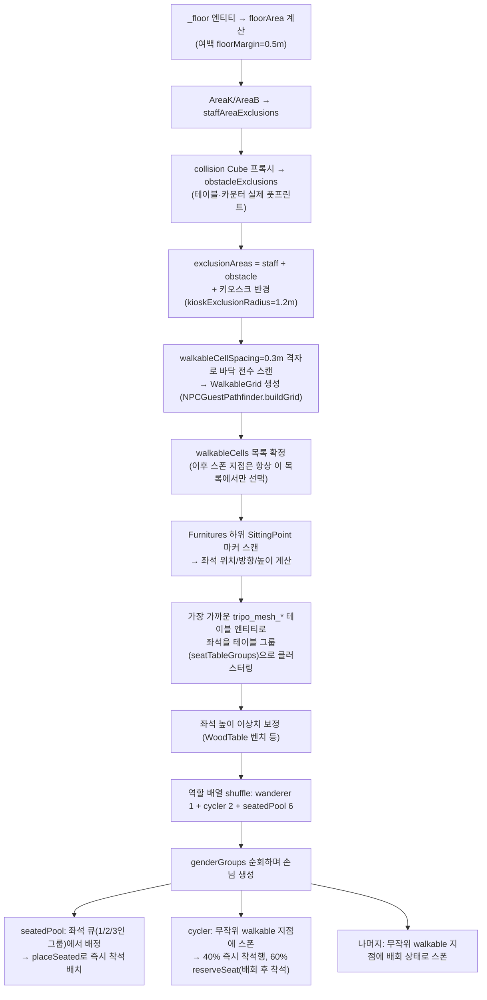
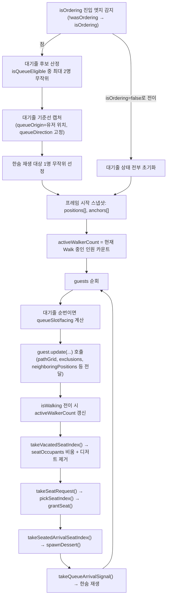
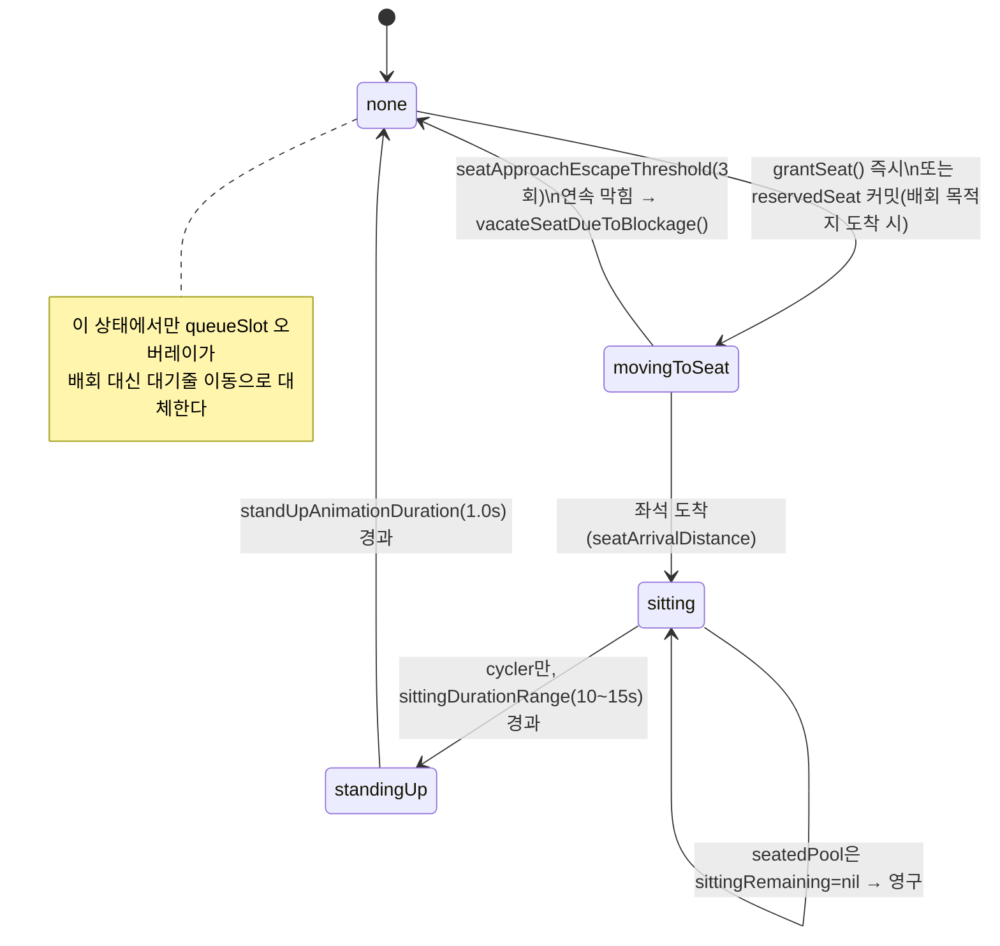
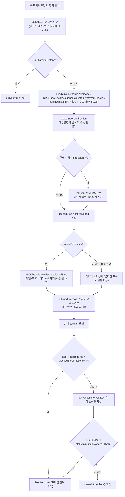
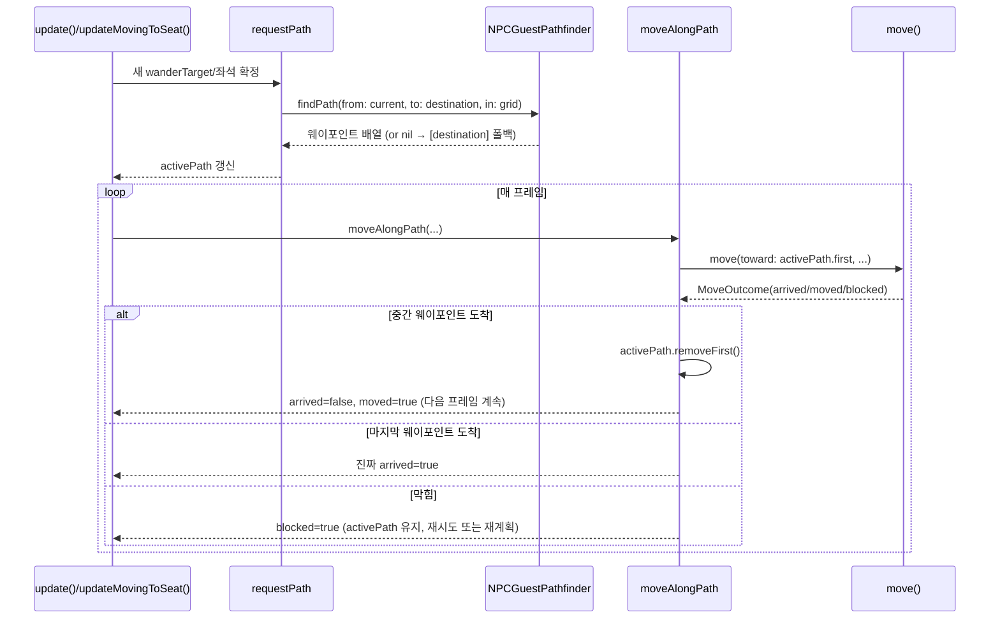

# 손님 NPC 이동/생성 로직 분석

> 대상 코드: `Barrier City/NPC/NPCGuestController.swift`, `NPCGuestCoordinator.swift`,
> `NPCGuestNavigation.swift`, `NPCGuestPathfinder.swift`, `NPCObstacleAvoidance.swift`,
> `NPCGuestLocalAvoidance.swift`
> 최초 작성 시점(2026-08-25)에는 A\* 경로탐색 도입이 워킹 트리에 미커밋 상태였다. 이후
> A\*가 커밋되었고(`feat: add A* waypoint pathfinding for guest navigation`), 이어서
> 다른 손님과의 **미래** 충돌을 예측해 미리 피하는 predictive local avoidance가
> 추가되었다(`feat: add guest motion snapshots for local avoidance` →
> `feat: add predictive guest collision detection` →
> `feat: steer guests around predicted collisions`). §6.2, §9.3, §10을 이 변경에
> 맞춰 갱신했다.

이 문서 하나만 읽어도 손님 NPC가 어떻게 태어나고(스폰), 어떻게 걷고 앉는지(상태 머신),
그 이동이 내부적으로 어떤 파이프라인을 거치는지, 그리고 지금 구조에서 어디가 약한
고리인지(병목/기술부채)를 파악할 수 있도록 구성했다.

---

## 1. 한눈에 보는 역할 지도

| 파일 | 책임 | 책임이 아닌 것 |
|---|---|---|
| `NPCGuestCoordinator` | 씬 진입 시 좌석/배회영역 스캔, 손님 N명 생성·역할 배분, 매 프레임 오케스트레이션, 좌석 점유 장부, 대기줄 슬롯 계산, 디저트 배치 | 개별 NPC의 이동 물리, 애니메이션 |
| `NPCGuestController` | 손님 **1명**의 상태 머신(배회/좌석이동/착석/기립), 실제 이동 계산, 애니메이션 큐 전환 | 다른 손님과의 조율(좌석 배정 결정, 대기줄 순번) |
| `NPCGuestNavigation` | 회전된 사각형 영역(`NPCGuestArea`) 기하 판정, 경계 침범 시 "탈출 허용" 로직 | 실제 이동, 장애물 인지 |
| `NPCGuestPathfinder` | 바닥 격자 위 8방향 A\*로 웨이포인트 경로 산출 | 프레임별 스텝 이동, 충돌 회피 |
| `NPCGuestLocalAvoidance` | 다른 손님과의 **미래** 충돌(TTC/최근접 거리)을 예측해 진행 방향을 좌/우로 보정 | 실제 스텝 적용, 하드 충돌 차단, 경로 재계산 |
| `NPCObstacleAvoidance` | 레이캐스트로 "이번 스텝에 실제로 갈 수 있는 거리"를 구함(가구·유저·다른 NPC) | 목적지 선택, 경로 전체 계획 |

대화(`NPCConversationAccessPolicy`, `NPCDialogueController` 등)와 근접 감지는 `NPCClerkController`
쪽 책임이며, 손님 NPC는 순수하게 **동선만** 담당하도록 의도적으로 분리되어 있다
(`NPCGuestController.swift:53` 주석).



---

## 2. 손님 3역할과 생성 규모

`NPCGuestCoordinator.Tuning`에 정의된 인원 구성(`NPCGuestCoordinator.swift:59-83`):

| 역할 | 인원 | 행동 | 대기줄 후보 |
|---|---|---|---|
| `alwaysWandering` | 1 | 절대 앉지 않고 계속 배회 | 항상 후보 |
| `cycler` | 2 | 배회 ↔ 착석(10~15초) ↔ 기립을 반복 | 배회 중일 때만 후보 |
| `seatedPool` | 6 | 입장부터 가능하면 착석 상태로 시작, 한 번 앉으면 영구 착석 | 항상 제외 |

총 9명이 세 역할에 배정되고, `genderGroups`가 제공하는 표시 이름(성별당 5명, 총 10명)
중 배정되지 않은 나머지는 자동으로 `alwaysWandering`으로 폴백한다
(`NPCGuestCoordinator.swift:366-369`). 원본 엔티티는 `Female`/`MaleIdle` 단 2개뿐이며
나머지는 `entity.clone(recursive:)`로 복제해서 만든다.

역할은 **입장 시 1회 고정**이며 이후 런타임에 바뀌지 않는다. `cycler`가 앉았다 일어나도
역할 자체는 그대로 `cycler`다.

---

## 3. 생성(스폰) 흐름 — `enterIndoor`

`SceneSwitcher`가 실내 씬으로 전환하는 한 MainActor 구간 안에서 1회 호출된다
(`SceneSwitcher.swift:185`). 아래 순서로 진행된다.



핵심 설계 포인트:

- **스폰 실패가 구조적으로 없다.** 예전에는 무작위 좌표를 찍고 막히면 버리는 방식이었지만,
  지금은 바닥을 격자로 미리 전수 스캔해 "설 수 있는 칸" 목록을 만들어 두고 그 안에서만
  뽑는다(`isSafeSpawn` = 영역 유효성 + `isClearOfFurniture` 레이캐스트).
- **같은 격자를 이동(A\*)에도 재사용한다.** `walkableGrid`는 스폰 검증과 경로탐색이
  동일한 좌표계·동일한 "걸을 수 있는 칸" 정의를 공유하게 만든다.
- **좌석 테이블 그룹핑은 위치 거리 클러스터링이 아니라 entity identity 기준**이다
  (`NPCGuestCoordinator.swift:135-145`). 거리 기반은 가까이 붙은 서로 다른 물리적
  테이블을 잘못 합치는 회귀를 낳았다는 게 코드 주석에 기록되어 있다.
- **cycler는 좌석 근처가 아니라 무작위 지점에서 스폰**한다. 좌석 근처 스폰(예전 방식)은
  여러 cycler가 같은 좌석 주변에 몰리는 문제와 얽혀 있었다.

---

## 4. 매 프레임 오케스트레이션 — `NPCGuestCoordinator.update`

`InteractionSetup`이 매 프레임 호출하며, 가드 잠금 상태에서도(`isOrdering: false`로)
계속 불려 NPC가 멈추지 않는다(`InteractionSetup.swift:145`).



주목할 점:

- **좌석 점유/해제는 그 프레임의 `update()` 결과를 반영해 즉시 처리한다.** 방금 일어난
  자리를 같은 프레임에 바로 다른 손님에게 재배정할 수 있어, 빈 프레임 없이 이어진다.
- **동시 배회 인원 제한(`maxConcurrentWalkers = 3`)은 "새로 걷기 시작하는" 순간에만
  적용**되고, 이미 걷고 있던 손님은 막지 않는다. 그렇지 않으면 벽 앞에서 뚝 멈추는
  것처럼 보이기 때문이다.
- **`NPCGuestController`가 노출하는 5개의 "원샷 신호"**(`takeSeatRequest`,
  `takeVacatedSeatIndex`, `takeSeatedArrivalSeatIndex`, `takeQueueArrivalSignal`,
  내부용 `hasReportedQueueArrival`)를 Coordinator가 매 프레임 폴링(pull)해서 소비한다.
  이 순서(vacate → request → arrival → sigh)는 코드에 암묵적으로 고정되어 있다
  (§9 병목 참고).

---

## 5. 개별 NPC 상태 머신 — `NPCGuestController`

내부 `SeatState`(`none`/`movingToSeat`/`sitting`/`standingUp`)가 골격이고, 대기줄
(`queueSlot`)은 이 상태와 **직교하는 오버레이**로 처리된다 — `.none` 상태에서
`queueSlot`이 주어지면 배회 대신 대기줄로 이동하고, 대기줄이 사라지면 다시 원래 배회로
복귀한다.



`none`(=배회) 상태 안에서는 다시 다음 하위 흐름이 있다(`NPCGuestController.swift:434-576`):

1. 경계 위반 복구가 최우선(`requiresRecovery`) — 정지 타이머·보행 예산보다 앞선다.
2. `pauseRemaining > 0`이면 Idle 유지.
3. `wanderTarget`이 없으면 새 목적지 선택 — 단, `allowNewWander`(동시 배회 예산)를
   만족하거나 경계 복구 중일 때만 **새로** 걷기 시작한다.
4. `moveAlongPath`로 이동, 결과에 따라 `blocked`/`arrived`/진행 중 분기.
5. 도착 시 `reservedSeat`가 있으면 확률 없이 항상 그 좌석으로 커밋, 없으면 확률적으로
   착석 요청(`sitDesireChance`, 개인차 0.55~0.9)을 세운다.

---

## 6. 이동 파이프라인 — `move()` (핵심 알고리즘)

한 프레임에 한 웨이포인트를 향해 걷는 최소 단위 함수다. `moveAlongPath`가 `activePath`의
첫 웨이포인트를 이 함수에 넘기고, 도착하면 다음 웨이포인트로 넘어간다.



### 6.1 "막힘"을 잡는 3중 안전망

같은 문제(장애물 앞에서 진짜로 못 나아가는데 Walk 애니메이션만 반복되는 현상)를
세 가지 시간축에서 각각 다르게 감지한다 — 코드 주석에 각 계층이 왜 필요한지
구체적인 과거 증상이 기록되어 있다.

| 계층 | 판정 기준 | 잡아내는 증상 |
|---|---|---|
| 프레임 단위 (`blockedStepFraction`) | 이번 스텝이 원하는 폭의 40% 미만 | 정면으로 완전히 막힌 경우 |
| 시간 누적 (`stallCheckInterval` 1.2s) | 1.2초간 순이동이 0.15m 미만 | 장애물에 얕은 각도로 걸려 매 프레임은 40%를 넘지만 밀렸다 되밀렸다 하며 실제로는 거의 못 나아가는 경우 |
| 연속 실패 (`stuckEscapeThreshold` 3회 / `seatApproachEscapeThreshold` 3회) | 배회는 3회 연속 blocked, 좌석 이동은 3회 연속 blocked | 막다른 구석이라 무작위 후보가 계속 같은 방향만 뽑히는 경우 → `nearbyEscapeTarget`(원형 레이캐스트 탐색)로 전환 |

배회 중 막힘과 좌석 이동 중 막힘은 **대응이 다르다**: 배회는 새 무작위 목적지를 즉시
다시 고르지만, 좌석 이동은 몇 번 그 자리에서 재시도(정적 장애물은 이미 A\*가 피해서
잡은 경로이므로, 막히는 원인은 대개 다른 손님/유저가 일시적으로 그 웨이포인트를 막고
서 있는 경우)한 뒤에야 `vacateSeatDueToBlockage()`로 자리를 반납한다.

### 6.2 예측 동적 회피 — `NPCGuestLocalAvoidance` (반응형 vs 예측형)

§6.1의 3중 안전망과 `crowdSteeredDirection`의 개인공간 반발은 전부 **반응형
(reactive)**이다 — "지금 가까운" 이웃에만 반응하므로, 아직 떨어져 있지만 정면으로
다가오는 두 손님을 충분히 일찍 피하게 하지 못해 부딪히기 직전에야 급하게 꺾이거나
멈추는 것처럼 보였다. `NPCGuestLocalAvoidance`는 이 문제를 등속 직선 운동을 가정한
**closest-approach-time(TTC)** 계산으로 보완한다.

```text
relativePosition = neighbor.position - myPosition
relativeVelocity  = neighbor.velocity - myVelocity
tClosest = clamp(-dot(relPos, relVel) / dot(relVel, relVel), 0...predictionHorizon)
closestDistance   = length(relPos + relVel * tClosest)
```

`closestDistance`가 회피 반경보다 가까우면 위험으로 보고, targetDirection을
`sidePreference`(=`movementProfile.separationSide`, NPC 생성 시 한 번 고정되는 값) 쪽
측면으로 위험도(urgency)에 비례해 살짝 민다. 기하학적으로 매 프레임 좌/우를 다시
계산하지 않는 이유: 정면으로 마주친 상황은 근소한 차이로도 좌/우 판정이 뒤집힐 수
있어, 그렇게 하면 "왼쪽→오른쪽→왼쪽"으로 흔들리는 진동이 생긴다. NPC마다 고정된
방향 선호를 쓰면 같은 NPC는 항상 같은 쪽으로 비켜서므로 이 진동이 구조적으로
발생하지 않는다.

파이프라인 상 위치는 §6.1 다이어그램의 `targetDirection` 계산 직후, `crowdSteeredDirection`
직전이다 — "아직 먼 위험은 미리 방향만 트는" 예측 레이어를 먼저 거친 뒤, "이미 가까운
이웃은 강하게 밀어내는" 즉시 반발이 마지막으로 다듬는 순서다. 새 튜닝 파라미터를 최소화
하기 위해 기존 값 두 개를 그대로 재사용한다:

- **`separationScale`**(대기줄 0.35 / 좌석 접근 0.5 / 자유 배회 1.0)을 예측 회피 세기
  배율로도 그대로 쓴다 — 컨텍스트별 새 파라미터 없이 대기줄·좌석 접근이 자연히 더
  약하게 반응한다.
- **`movementProfile.separationSide`**를 좌/우 결정에 그대로 쓴다(위 설명 참고).

`avoidObstacles`가 꺼지는 구간(좌석 코앞 `seatCollisionBypassDistance` 이내)에서는
이 레이어도 같이 꺼진다 — `NPCObstacleAvoidance`의 이웃 하드 블록이 같은 구간에서
이미 꺼지는 것과 동일한 이유(좌석 콜리전 프록시를 관통해 마지막 한 걸음을 확실히
딛어야 한다)다.

**정지한 이웃(속도 ≈ 0)은 예측 대상에서 완전히 제외한다**
(`NPCGuestLocalAvoidance.Tuning.minimumNeighborSpeed`). TTC 예측은 원래 "서로
다가오는 두 이동체"를 다루기 위한 것인데, 좌석으로 걸어가는 손님에게는 목적지
바로 옆에 이미 앉아있는 손님이 항상 있다 — 그 손님을 계속 "피해야 할 미래
위험"으로 보면, 막힘 판정을 아슬아슬하게 피해가며(3연속 실패 임계값에는 못
미치지만 순 이동도 거의 없는) 자기 좌석 근처에서 서성이기만 하고 정작 앉지
못하는 교착에 빠졌다(실제 관찰된 회귀 — §9.3 참고). 이미 가까워진 뒤의 안전은
여전히 즉시 반발과 하드 세이프티 넷이 정지한 이웃에도 그대로 적용되므로 담당한다
— 빠지는 건 "아직 멀리 있을 때부터 미리 피하기"뿐이다. 배회 중 잠깐 멈춰 선
손님도 같은 기준으로 제외되지만(운동학적으로 좌석에 앉은 손님과 구분할 수 없다),
그 경우는 원래도 가까이 접근했을 때만 즉시 반발/하드 세이프티 넷이 대응하면
충분한 상황이라 실질적 손실은 작다.

**A\* 경로 자체는 건드리지 않는다** — `wanderTarget`/`activePath`를 재계산하거나
버리지 않고, 이번 스텝 하나의 방향만 보정한다. `NPCObstacleAvoidance`의 레이캐스트·
원-원 스윕은 이 레이어 뒤에서 최종 하드 세이프티 넷으로 그대로 남는다 — 예측이
잘 작동하면 그 하드 클램프가 자주 걸리지 않는 게 정상이다.

속도 입력은 **실측값**이다. `NPCGuestController.velocity`는 commanded 속도
(`movementProfile.moveSpeed`)가 아니라 update() 전후 실제 위치 변화량을 deltaTime으로
나눈 값(가벼운 지수 평활만 적용)이다 — 장애물에 막혀 실제로는 거의 못 움직이는
NPC가 "빠르게 다가오는 대상"으로 잘못 예측되지 않게 하기 위함이다.
`NPCGuestCoordinator.update`가 프레임 시작 시점에 `positions`/`anchors`와 함께
`velocities`도 스냅샷해, 같은 프레임 안에서 먼저 갱신된 손님의 새 값이 아니라 항상
"이 프레임 시작 시점" 값만 이웃 판단에 쓰이게 한다(순서 의존성 제거).

---

## 7. 경로탐색 — `NPCGuestPathfinder` (진행 중인 변경의 핵심)

**이 변경 전에는** `move()`가 목적지를 향해 항상 직선으로 스티어링했다. 긴 바 테이블처럼
큰 장애물이 사이에 있으면 직선이 계속 막혀 같은 자리에서 튕겨 나오길 반복하는
문제(§9 참고)가 있었다.

**지금은** 새 목적지를 고를 때마다 `requestPath`가 `NPCGuestPathfinder.findPath`로
8방향 A\* 경로를 한 번 계산해 `activePath`(웨이포인트 배열)에 담아 두고,
`moveAlongPath`가 그 웨이포인트를 순서대로 `move()`에 넘긴다. `move()` 자체의
스티어링/레이캐스트 회피/군중 반발 로직은 그대로 유지되며, "먼 목적지 하나"였던 것이
"가까운 중간 목표들의 연쇄"로 바뀐 것이 핵심이다.



세부 특징:

- **격자가 없거나 경로를 못 찾으면(고립 영역 등) 목적지 하나만 담은 배열로 폴백**해
  예전의 직선 이동과 동일하게 동작한다 — 완전히 멈추지는 않는다.
- **좌석은 격자 밖(u/v가 [-1,1]을 살짝 넘음)에 있을 수 있어**, `nearestWalkableCell`이
  반경을 넓혀가며 가장 가까운 유효 셀로 스냅한다.
- **직선 구간은 중간 웨이포인트를 쳐낸다(`simplify`)** — `move()`가 매 셀마다
  재조준하지 않고 곧장 걷게 한다.
- **A\* 자체는 매 프레임이 아니라 "새 목적지를 고를 때만" 1회 호출**된다. open list는
  힙이 아니라 배열 정렬(`openHeap.sort()`)이며, 주석에 "노드 수가 격자 전체(수백~수천)라
  힙 없이도 실용적인 속도가 나온다"고 명시되어 있다 — 현재 규모 전제의 트레이드오프다.

---

## 8. 좌석 배정과 대기줄

### 8.1 좌석 선택 — `pickSeatIndex`

- 좌석이 `communalTableSeatThreshold`(6석) 이상인 "공용 테이블"(벤치형 WoodTable 등)은
  **물리적으로 인접한 빈 자리를 우선** 채운다(빈 자리가 중간에 듬성듬성 남지 않게).
- 일반 테이블(2~4인)은 문턱을 넘지 않으므로 **전체 빈 좌석 중 완전 무작위**.
- 예전에는 "이미 앉은 손님들과 가장 멀리 떨어진 자리"를 결정론적으로 골랐는데, cycler가
  자리를 옮길 때마다 매번 같은 자리로 돌아가 "고정석"처럼 보이는 부작용이 있어 지금
  방식으로 바뀌었다.

### 8.2 대기줄 — `queueSlot`

- 유저가 키오스크 트리거 반경이 아니라 **더 좁은 `guestQueueTriggerRadius`** 안에 있을
  때만 형성된다(`InteractionSetup.swift:196-198`).
- 형성되는 순간(`isOrdering` 진입 엣지) `queueOrigin`(유저 위치)과 `queueDirection`
  (키오스크→유저 방향)을 **고정 캡처**해, 이후 유저가 트리거 반경 안에서 조금 움직여도
  줄 전체가 흔들리며 재정렬되지 않는다.
- 대기줄 이동은 유저 반경 회피(`avoidPlayer`)를 의도적으로 끈다 — 대기줄은 유저 바로
  뒤까지 다가가야 하는 예외적 이동이기 때문이다.

---

## 9. 병목 및 리스크

구조적 우려를 성능/설계 두 축으로 나누고, 영향과 확인된 근거(코드 위치)를 표시했다.
"현재"는 손님 10명 규모에서는 대부분 체감 문제가 없다고 판단되지만, **인원을 늘리거나
씬을 넓히는 방향의 변경을 검토할 때 먼저 재확인해야 할 지점**들이다.

### 9.1 성능

| 위치 | 문제 | 스케일 영향 | 참고 |
|---|---|---|---|
| `NPCGuestCoordinator.update` | 매 프레임 `guests.map(\.currentPosition)` 등으로 O(N) 스냅샷, guest마다 O(N) neighbor 필터링 → 전체 O(N²) | N=10에서는 무해, N이 수십 단위로 늘면 프레임 비용 급증 | `NPCGuestCoordinator.swift:840-860` |
| `NPCObstacleAvoidance.allowedStep` | guest 1명당 최대 3개 레이(좌/중/우) + 유저 1 + 이웃 N개에 대해 원-원 스윕 계산, 매 프레임·이동 중인 모든 guest에 대해 반복 | 레이캐스트는 CPU 비용이 상대적으로 크다 — 동시 이동 인원(`maxConcurrentWalkers=3`)으로 이미 완화되고 있지만, 이 제한을 늘리면 직접 비례해 증가 | `NPCObstacleAvoidance.swift:38-75` |
| `NPCGuestPathfinder.findPath` | open list가 힙이 아니라 매 pop마다 `sort()` — 주석에도 "격자가 수백~수천 노드일 때만 실용적"이라고 명시 | `walkableCellSpacing=0.3m` 기준 192㎡ 바닥이면 격자가 이미 수천 셀에 근접 — 방이 커지거나 셀을 더 촘촘히 하면 이 부분이 먼저 느려질 후보 | `NPCGuestPathfinder.swift:133-137` |
| `enterIndoor`의 `buildGrid` | 격자 셀 하나당 레이캐스트 1회(`isSafeSpawn`) | 씬 진입 시 1회성이라 상시 부담은 아니지만, 재진입(실내↔실외 반복)마다 반복 계산됨 | `NPCGuestCoordinator.swift:244-246` |

### 9.2 설계/유지보수

| 위치 | 문제 | 리스크 |
|---|---|---|
| `exclusions` vs `staffExclusions` 이원화 | 호출부마다 "전체 제외 구역"과 "직원 구역만"을 정확히 구분해 넘겨야 하는 **암묵적 규약**. 실제로 과거에 이걸 잘못 넘겨 cycler가 좌석에 영원히 도착 못 하는 버그가 있었다고 코드 주석에 기록됨(`NPCGuestController.swift:382-391`) | 새 이동 종류를 추가할 때 같은 클래스의 버그가 재발하기 쉬움 — 두 목록의 의미 차이가 타입으로 강제되지 않고 주석으로만 남아 있음 |
| `NPCGuestController` 단일 파일 1000줄+ | 이동 물리(스티어링/레이캐스트 클램프/막힘 감지) + 좌석 상태 머신 + 애니메이션 큐 전환이 한 클래스에 응집 | 세 관심사 중 하나만 바꿔도 전체 파일을 훑어야 함. 예: 애니메이션 큐 전환 로직만 떼어내도 가독성이 오를 여지 |
| 튜닝 상수가 두 파일에 분산 | `NPCGuestController.NPCGuestTuning`(개인 이동)과 `NPCGuestCoordinator.Tuning`(전역 구성)이 분리되어 있고 서로 참조하는 값도 있음(예: `bodyHalfWidth`를 `Coordinator.Tuning.walkableCellSpacing` 주석이 참조) | 값 하나를 바꿀 때 연쇄로 맞춰야 하는 다른 상수를 놓치기 쉬움 |
| `pending*` 원샷 신호 5종 (pull 방식) | `takeSeatRequest`/`takeVacatedSeatIndex`/`takeSeatedArrivalSeatIndex`/`takeQueueArrivalSignal`를 Coordinator가 **정해진 순서**(vacate→request→arrival→sigh)로 폴링해야 정상 동작 | 순서가 코드에 텍스트로만 존재 — 이후 리팩터링 중 순서가 바뀌면 조용히 깨질 수 있음(예: request를 vacate보다 먼저 소비하면 같은 프레임 재배정 기회를 놓침) |
| 좌석 상태 전이가 4곳에 분산 | `update()`(reservedSeat 커밋), `updateMovingToSeat()`(도착/막힘), `standUpAndResumeWandering()`(자동 기립), `vacateSeatDueToBlockage()`(포기) | `SeatState`를 한 곳에서 관리하는 게 아니라 여러 메서드가 각자 필드를 직접 건드림 — 상태 불변식(예: `sittingRemaining`은 cycler만 non-nil)이 코드 전체에 흩어져 있어 추적 비용이 있음 |
| `NPCGuestPathfinder`가 씬(`RealityKit.Scene`)에 의존하지 않는 순수 격자 로직인데, `isWalkable` 클로저 주입으로 `NPCObstacleAvoidance`(레이캐스트)에 간접 결합 | 의도된 설계(주석에도 명시)지만, 격자를 캐시하는 한 "씬이 바뀌지 않는다"는 전제가 암묵적으로 필요 — 가구가 동적으로 이동/생성되는 기능이 추가되면 `walkableGrid` 재계산 트리거가 지금은 없음 | 향후 동적 가구/좌석 기능 추가 시 반드시 확인 필요 |

### 9.3 A\* 도입 + 예측 동적 회피가 해소한 것 / 아직 남긴 것

- **A\*가 해소:** 큰 장애물을 사이에 둔 직선 이동의 "제자리 왕복" 현상 — 커밋 로그
  `d15ed0e`(손님 간 하드 블록), `2ba6419`(실제 콜리전 기반 제외 구역)와 같은 흐름에서
  나온 개선.
- **NPCGuestLocalAvoidance가 해소:** 정적 장애물은 A\*가 처리해도, 다른 손님과의
  충돌은 여전히 "이미 가까워진 뒤에야" 반응하는 문제가 남아 있었다(§6.2 도입 전
  상태). 이제 등속 외삽 기반 TTC 예측으로 아직 떨어져 있는 단계에서부터 미리 방향을
  틀 수 있다.
- **실기에서 발견되어 수정된 회귀 2건** (둘 다 예측 회피 도입 직후 실기 확인 중 관찰됨):
  1. *정적 장애물 앞 고착*: 좁은 통로에서 예측 회피가 미는 측면 방향이 하필 테이블/
     카운터였고, A\*가 골라준 원래 방향은 뚫려 있는데도 그쪽으로만 계속 밀려 막힘
     로그(`areaFraction=1.0`, `rayAfter=0.0`)가 반복됐다. `move()`가 이제 예측 보정
     방향이 완전히 막히면 예측 보정만 뺀 방향(즉시 반발은 유지)으로 한 번 더
     시도해 더 나아갈 수 있으면 그쪽을 쓴다.
  2. *좌석 접근 중 정지 이웃 앞 교착*: 좌석에 접근할 때 목적지 바로 옆에는 항상
     이미 앉아있는 손님이 있는데, 그 손님을 계속 "피해야 할 미래 위험"으로 보면
     막힘 판정을 아슬아슬하게 피해가며 자기 좌석 근처에서 서성이기만 하고 앉지
     못했다("의자에 앉지 않고 서 있는 NPC"로 관찰됨). 이웃의 속도가
     `minimumNeighborSpeed`보다 느리면(앉아있거나 잠깐 멈춰 선 경우) 예측 대상에서
     아예 제외하도록 고쳤다.
  3. *좌석이 실제보다 일찍 "비었다"고 통지됨(예측 회피와 무관한, 더 근본적인
     원인)*: `standUpAndResumeWandering()`이 기립 애니메이션을 "시작"하는 그
     프레임에 곧장 `pendingVacatedSeatIndex`를 세워 코디네이터가 그 좌석을 즉시
     재배정 가능하게 만들었다. 그런데 `.standingUp` 동안은 `standUpAnimationDuration`
     (1초) 내내 이 손님의 몸이 그 좌석 위치에 그대로 있다(이동하지 않는다). 그
     사이 새로 배정된 다른 손님이 걸어오면 아직 사람이 서 있는 자리로 다가가다
     `NPCObstacleAvoidance`의 이웃 하드블록에 아슬아슬하게 걸렸다 풀렸다를
     반복하며(3연속 실패 임계값에는 못 미치면서 순 이동도 없는) 좌석 근처에서
     서성이기만 했다 — 2번보다 이게 실제 "서 있는 NPC" 증상의 더 직접적인
     원인이었다. 좌석을 실제로 비웠다고 통지하는 시점을 기립 애니메이션이 끝나
     이 손님이 진짜로 그 자리를 벗어나는 순간으로 옮겼다(`vacateClaimedSeat()`).
  4. *(근본 원인) "연속 N회 막힘" 카운터가 흔들리는 막힘에 취약함*: 위 세 건을
     고친 뒤에도 여러 손님이 한 지점(키오스크·카운터 주변 등)에 몰려 옹기종기
     서 있기만 하는 게 실기에서 계속 관찰됐다. 원인은 `consecutiveBlockedCount`/
     `seatApproachBlockedCount`가 "연속으로" N번 막혀야만 탈출/포기로 넘어가는데,
     여러 NPC가 서로 미묘하게 밀고 밀리는 혼잡 상황에서는 한 프레임이 우연히
     `blockedStepFraction`을 살짝 넘겨(=그 프레임만 "막힘 아님") 카운터가 0으로
     리셋되는 일이 반복될 수 있었다는 점이다. 그러면 1.2초 넘게 순 이동이 거의
     없는데도(=`stallCheckInterval`/`isStalled`가 이미 감지하고 있었다) "3연속"에는
     영원히 못 미쳐 탈출/포기 로직 자체가 발동하지 않았다 — 세 번의 개별 트리거
     수정과 별개로 존재하는, 더 깊은 구조적 결함이었다. `MoveOutcome`에 `blocked`와
     분리된 `stalled` 필드를 추가해, 단 한 번의 stall(연속 횟수 무관)만으로도 즉시
     `nearbyEscapeTarget`/`vacateSeatDueToBlockage`가 발동하도록 고쳤다 — 새 감지
     시스템이 아니라 이미 있던 stall 신호를 카운터에 묻히지 않고 직접 쓰게 한
     것뿐이다.
- **아직 남은 것:**
  - A\*는 여전히 **정적** 장애물만 경로 자체에 반영한다. 다른 손님/유저가 웨이포인트를
    일시적으로 막는 경우는 §6.1의 "연속 실패 → 재시도/포기" 로직이 계속 담당한다 —
    경로 재계산이 아니라 프레임별 스티어링 보정(예측 회피 포함)과 임계값 기반
    휴리스틱의 몫이라는 기본 구도는 그대로다.
  - 예측 회피는 **다른 손님끼리만** 적용된다. 유저(휠체어)와의 충돌 회피는 여전히
    `NPCObstacleAvoidance`의 원-원 스윕(반응형, `avoidPlayer`)에만 의존한다 — 유저는
    NPC처럼 "다음 프레임 속도"를 예측할 근거(commanded velocity)가 없어 이번 범위에서
    의도적으로 제외했다.
  - 두 NPC가 우연히 같은 `separationSide`를 가지면(각자 독립적으로 무작위 배정되므로
    50% 확률) 정면 조우 시 같은 쪽으로 동시에 비켜 완전히 매끄럽게 스치지 못할 수
    있다 — 이 경우에도 좌우 진동 없이 한쪽으로만 계속 밀리다가 `NPCObstacleAvoidance`의
    하드 세이프티 넷과 거리 변화에 따른 TTC 재계산으로 결국 풀리지만, ORCA/RVO 같은
    상호(reciprocal) 회피만큼 항상 매끄럽지는 않다.

---

## 10. 코드 위치 빠른 인덱스

| 찾고 싶은 것 | 위치 |
|---|---|
| 손님 역할 정의 | `NPCGuestController.swift:27` `NPCGuestRole` |
| 이동/막힘 관련 전체 튜닝 상수 | `NPCGuestController.swift:57-116` `NPCGuestTuning` |
| 좌석 상태 머신 | `NPCGuestController.swift:118-125` `SeatState`, `update` 본문 405-436 |
| 이동 스텝 계산 핵심 | `NPCGuestController.swift:762-` `move(toward:...)` |
| 실측 속도 갱신 | `NPCGuestController.swift:220` `velocity` 프로퍼티, `905` `updateVelocity` |
| 경로 요청/소비 | `NPCGuestController.swift:717-760` `requestPath`/`moveAlongPath` |
| 예측 동적 회피 구현 | `NPCGuestLocalAvoidance.swift` `predictCollision`/`adjustedPreferredDirection` |
| 예측 회피 단위 테스트 | `Tests/NPCGuestLocalAvoidanceTests.swift` (swiftc 단독 실행) |
| 인원 구성·역할 배분 | `NPCGuestCoordinator.swift:34-100` `Tuning`, 204-434 `enterIndoor` |
| 매 프레임 진입점 | `NPCGuestCoordinator.swift:807-903` `update` |
| 좌석 선택 규칙 | `NPCGuestCoordinator.swift:446-462` `pickSeatIndex` |
| 대기줄 슬롯 계산 | `NPCGuestCoordinator.swift:911-943` `captureQueueLine`/`queueSlot` |
| A\* 구현 | `NPCGuestPathfinder.swift:103-178` `findPath` |
| 레이캐스트 스텝 클램프 | `NPCObstacleAvoidance.swift:28-76` `allowedStep` |
| 영역 기하/탈출 허용 로직 | `NPCGuestNavigation.swift` 전체 |
| 씬 진입 호출부 | `SceneSwitcher.swift:185-189` |
| 매 프레임 호출부(가드/일반) | `InteractionSetup.swift:145`, `200-203` |
